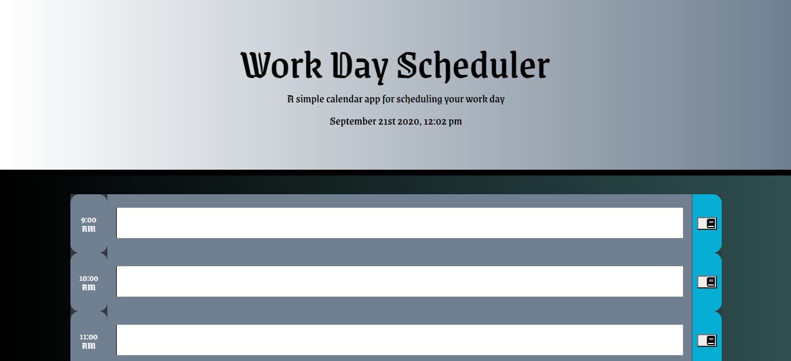
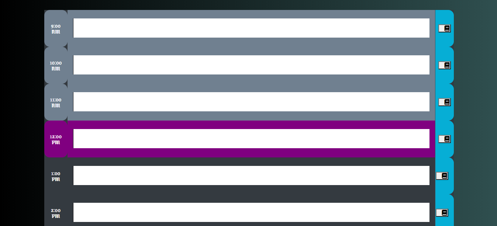
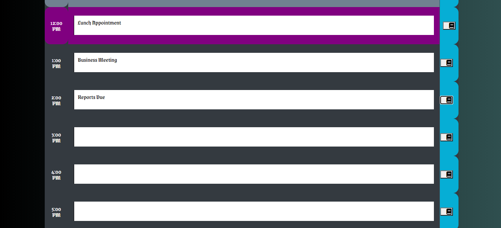

# Day Planner
Created by Jordan Sarvay

The Day Planner website allows for users to plan out their day and the website will update accordingly based on what hour of the day it is, and reflect that with a color changing table.

Users May:
1. Dynamically receive today's date and current time and see it displayed at the top of the page.

2. See the hour by hour change color based on whether a block is the current time, a past time, or a future time.

3. Store data in the text areas which will be stored into local storage.

4. See stored data populate the text areas when reloading the page.

For any questions or concerns regarding the use of this app, please reach out to Jordan Sarvay at 804-305-4878 or by email at jordans1@vt.edu

Deployed URL: https://jsarvay.github.io/Day-Planner/

